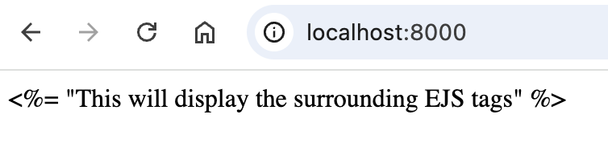

# EJS Tags

## Overview

EJS uses special tags to dynamically render content in templates, and differentiate between regular HTML and JavaScript logic. This section will cover common EJS tags, and how to use them to output variables, escape HTML, add comments, and more. The following guide will walk you through how to use different EJS tags in a task manager.

---

## Using EJS Tags in a Task Manager Dashboard

Before you begin, you will need to set up your environment. For more detailed instructions on how to do this, see our guide on [Integrating EJS with Express for Rendering Templates](integration.md).

### 1. Set Up Your Environment

**Open** your code editor and **create** or open your EJS file.

Make sure Node.js and Express are **installed.**

---

### 2. **Insert** a Scriptlet Tag (`<% %>`)

The Scriptlet Tag is used to execute JavaScript code. These tags are used for control flow and do not output anything to the HTML.

**Insert** a conditional check to display a welcome message if the user is logged in.

```html
<% if (user) { %>
    <p>Welcome to your Task Manager Dashboard.</p>
<% } %>
```

---

### 3. **Insert** an Escaped Output Tag (`<%= %>`)

The Escaped Output Tag is used to output values to the HTML. This tag esapes HTML to prevent cross-site scripting (XSS) attacks.

**Insert** an Escaped Output Tag to greet the user.

```html
<h1>Welcome, <%= user.name %>!</h1>
```

!!! info "HTML Escaping"

    HTML Escaping converts special characters like `<`, `>`, and `&` into their HTML character entities (`&lt;`, `&gt;`, and `&amp;`). HTML Escaping prevents hackers from injecting malicious code into your webpage.

---

### 4. **Insert** an Unescaped Output Tag (`<%- %>`)

The Unescaped Output Tag is similar to the Escaped Output Tag, except that it does not escape HTML. When using these tags, HTML content will be rendered as actual HTML elements.

**Insert** an Unescaped Output Tag to include a task list partial. For further details on how to do this, see our guide on [Using Partials with EJS](partials.md).

```html
<%- include('partials/tasklist.ejs') %>
```

!!! warning "Unescaped Output Tag"

    Unescaped Output Tags allow raw HTML to be injected into your webpage. This can be dangerous, and should only be used when the content is coming from a trusted source. If a user is allowed to inject unescaped HTML, it could allow for XSS attacks.

---

### 5. **Insert** a Comment Tag (`<%# %>`)

The Comment Tag is used to write comments in EJS files. Comments made using the comment tag will not be visible in the source code. These tags can be used to hide notes or explanations.

**Insert** a comment tag to describe the code that is injected in your Unescaped Output Tag from step 4.

```html
<%# This section displays the user’s pending tasks %>
```

---

### 6. **Insert** Literal Tags (`<%%` and `%%>`)

The Literal Tag is used to output a raw EJS tag. These tags escape the EJS, and display `<%` and `%>` as plain text in the browser.

Optional: If you would like to experiment with using Literal Tags, **insert** literal tags to show the EJS tags instead of executing them.

```html
<%%= "This will display the surrounding EJS tags" %%>
```

#### HTML Output



---

## Conclusion

You have completed the steps to use EJS tags in the context of a Task Manager Dashboard. You can now run JavaScript logic, output both escaped and raw HTML, include internal comments, and display literal code EJS tags. By following this guide and being aware of security concerns, you can use these tags to effectively create dynamic web pages.

Download a sample solution for the task-manager here: [task-manager.zip](./assets/task-manager.zip){:download="task-manager"}

### Summary of EJS Tags

| EJS Tag         | Usage                                  |
| --------------- | -------------------------------------- |
| `<% %>`         | Logic (conditional statements, loops)  |
| `<%= %>`        | Safe (escaped) content injection       |
| `<%- %>`        | Raw (unescaped) content injection      |
| `<%# %>`        | Comments                               |
| `<%%` and `%%>` | Displaying `<%` and `%>` as plain text |