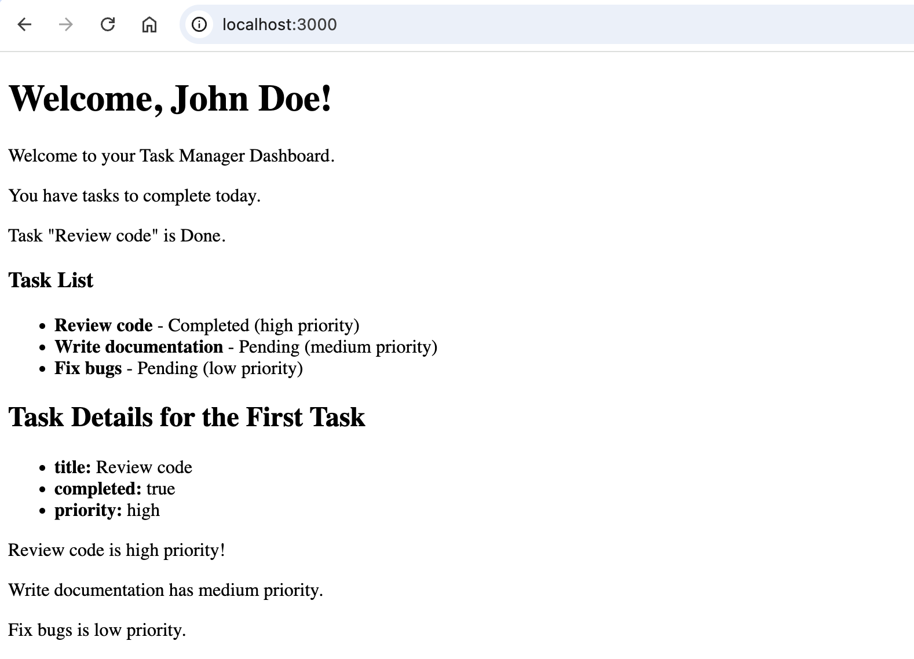

# Using EJS Loops and Conditionals

## Overview

This guide demonstrates how to use loops and conditional statements in your EJS templates in the context of a Task Manager Dashboard. EJS allows you to use JavaScript logic to display dynamic content. This section will cover common control structures that you may want to use when embedding JavaScript logic into HTML. In the following steps, you will see how to control the display of tasks based on their properties and iterate over a list of tasks

---

## Conditionals

We use `<% %>` tags to embed JavaScript logic into HTML without outputting content.

!!! warning "EJS Tags"

    Using incorrect EJS tags will result in unexpected behaviour or errors. Please refer to this guide's EJS Tags section for details on the different EJS tags.

---

### 1. Set Up Your Environment

**Open** your code editor and **create** or open your EJS file. We recommend first completing the guide on [EJS Tags](ejs_tags.md)

Make sure Node.js and Express are **installed.**

### 2. Basic `if` Statement

You can use a basic `if` statement to display content if a certain condition is met. 

**Insert** a basic `if` statement to check if any tasks exist.

```html
<% if (tasks.length > 0) { %>
    <p>You have tasks to complete today.</p>
<% } %>
```

---

### 3. `if-else` Statement

`if-else` statements can be used to display different content when a condition is true or false.

**Insert** an `if-else` statement to display if a task is completed or pending.

```html
<% tasks.forEach(task => { %>
    <% if (task.completed) { %>
        <p><%= task.title %> is completed.</p>
    <% } else { %>
        <p><%= task.title %> is pending.</p>
    <% } %>
<% }); %>
```

---

### 4. `else-if` Chain

A chain of `else-if` statements can be used to inject different HTML depending on the value of a variable.

**Insert** an `else-if` chain to check the priority of tasks.

```html
<% tasks.forEach(task => { %>
    <% if (task.priority === 'high') { %>
        <p><%= task.title %> is high priority!</p>
    <% } else if (task.priority === 'medium') { %>
        <p><%= task.title %> has medium priority.</p>
    <% } else { %>
        <p><%= task.title %> is low priority.</p>
    <% } %>
<% }); %>
```

---

### 5. Shorthand Conditional Statement

Shorthand conditional statements are convenient for simple logic inside of `<%= %>` tags.

**Insert** a shortand conditional statement to display the status for the first task.

```html
<p>Task "<%= tasks[0].title %>" is <%= tasks[0].completed ? 'Done' : 'Not Done' %>.</p>
```

---

## Loops

Loops can be used to iterate over arrays or objects to dynamically inject repetitive HTML content.

---

### 1. `for` Loop

A simple `for` loop can be used to populate HTML with repetitive content.

**Insert** a `for` loop to list all of the tasks.

```html
<% for (let i = 0; i < tasks.length; i++) { %>
    <h3>Task <%= i + 1 %>: <%= tasks[i].title %></h3>
<% } %>
```

---

### 2. `forEach` Loop

You can loop through arrays using a `forEach` loop.

**Insert** a `forEach` loop to display each task.

```html
<% tasks.forEach(task => { %>
    <p>Task: <%= task.title %></p>
<% }); %>
```

---

### 3. `for`...`in` Loop

To loop through key-value pairs of an object, we can use a `for`...`in` loop.

**Insert** a `for`...`in` loop to show the details of the first task.

```html
<% let task = tasks[0]; %>
<ul>
    <% for (let key in task) { %>
        <li><%= key %>: <%= task[key] %></li>
    <% } %>
</ul>
```

---

#### Sample Task Manager Website




---

## Conclusion

By following these instructions, you have learned how to use conditional statements and loops in your EJS templates. You can now use the techniques described in this section to dynamically display content.

Download a sample solution for the task-manager here: [task-manager.zip](./assets/task-manager.zip){:download="task-manager"}. 

After **downloading** and **extracting** the files, navigate to the project folder and **run** `npm install` (or `yarn`) to install dependencies, then `npm start` to **launch** the application.