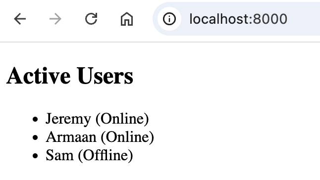

# Using EJS Loops and Conditionals

## Overview
EJS allows you to use JavaScript logic to display dynamic content. This section will cover common control structures that you may want to use when embedding JavaScript logic into HTML.

---

## Conditionals

We use `<% %>` tags to embed JavaScript logic into HTML without outputting content.

!!! warning "EJS Tags"

    Using incorrect EJS tags will result in unexpected behaviour or errors. Please refer to this guide's EJS Tags section for details on the different EJS tags.

---

### Basic `if` Statement

You can use a basic `if` statement to display content if a certain condition is met. 

#### Example: Greet User if They Are Logged In

```html
<% if (user) { %>
    <p>Hello, <%= user.name %>!</p>
<% } %>
```

---

### `if-else` Statement

`if-else` statements can be used to display different content when a condition is true or false.

#### Example: Changing Text Depending on the Weather

```html
<% if (weather.isSunny) { %>
    <p>It's a beautiful day!</p>
<% } else { %>
    <p>Let's stay inside today.</p>
<% } %>
```

---

### `else-if` Chain

A chain of `else-if` statements can be used to inject different HTML depending on the value of a variable.

#### Example: Display a Teacher's Comment Depending on Student Grade

```html
<% if (student.grade > 90) { %>
    <p>Great job!</p>
<% } else if (student.grade > 75) { %>
    <p>Good Job!</p>
<% } else { %>
    <p>Please come see me during office hours.</p>
<% } %>
```

---

### Shorthand Conditional Statement

Shorthand conditional statements are convenient for simple logic inside of `<%= %>` tags.

#### Example: Completing a Sentence Using a Ternary Operator

```html
<p>You are <%= user.age >= 18 ? 'an adult' : 'a minor' %>.</p>
```

---

## Loops

Loops can be used to iterate over arrays or objects to dynamically inject repetitive HTML content.

---

### `for` Loop

A simple `for` loop can be used to populate HTML with repetitive content.

#### Example: Create Headings For Numbered Items

```html
<% for (let i = 1; i <= 5; i++) { %>
    <h2>Item <%= i %></h2>
<% } %>
```

---

### `forEach` Loop

You can loop through arrays using a `forEach` loop.

#### Example: Greet Each User in an Array of Users

```html
<% users.forEach((user) => { %>
    <p>Hello, <%= user.name %></p>
<% }); %>
```

---

### `for`...`in` Loop

To loop through key-value pairs of an object, we can use a `for`...`in` loop.

#### Example: Display Information About a User

```html
<h2>User Info</h2>
<ul>
  <% for (let key in user) { %>
    <li><<%= key %>: <%= user[key] %></li>
  <% } %>
</ul>
```

---

## Practical Example: List Users and Their Status

```html
<% let users = [
    { name: 'Jeremy', online: true },
    { name: 'Armaan', online: true },
    { name: 'Sam', online: false }
]; %>

<h2>Active Users</h2>
<ul>
    <% users.forEach(user => { %>
    <% if (user.online) { %>
        <li><%= user.name %> (Online)</li>
    <% } else { %>
        <li><%= user.name %> (Offline)</li>
    <% } %>
    <% }); %>
</ul>
```

### HTML Output


---

## Conclusion

You're all set to use conditional statements and loops in your EJS templates! You can now use the techniques described in this section to dynamically display content.