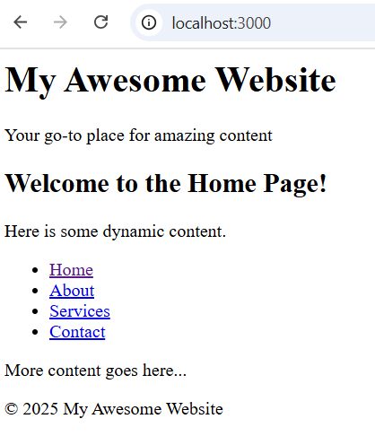
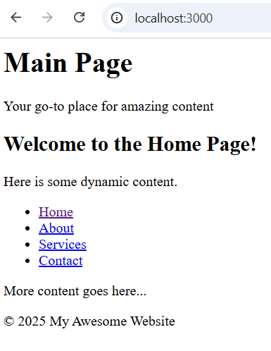

# Using Paritals with EJS 

## Overview

A key feature of **EJS** is the ability to use partials, which are reusable snippets of HTML that can be included in different views. Partials can help avoid code duplication and promote a cleaner, more maintainable codebase.

This documentation explains how to integrate partials into your **EJS** templates.

## What are Partials?

Partials are small chunks of HTML that can be reused across multiple **EJS** templates. Common examples of partials include headers, footers, navigation bars, and sidebars. Instead of writing the same HTML code in every template, you can create partials and include them in other views, making your templates modular and easier to maintain.

# Creating Partials in EJS

## 1. Create a Partials Folder
To organize partials, it's a good practice to create a ```partials``` folder within your ```views``` directory.

```
views/
  ├── partials/
  │    ├── header.ejs
  │    ├── footer.ejs
  │    └── nav.ejs
  └── index.ejs
```

## 2. Create Partial Files
Create your partial files (e.g., ```header.ejs```, ```footer.ejs```, ```nav.ejs```) inside the ```partials``` folder.

**Example: header.ejs**
```html
    <header>
        <h1>My Awesome Website</h1>
        <p>Your go-to place for amazing content</p>
    </header>
```

**Example: footer.ejs**
```html
    <footer>
        <p>&copy; 2025 My Awesome Website</p>
    </footer>
```

**Example: nav.ejs**
```html
    <nav>
    <ul>
        <li><a href="/">Home</a></li>
        <li><a href="/about">About</a></li>
        <li><a href="/services">Services</a></li>
        <li><a href="/contact">Contact</a></li>
    </ul>
    </nav>
```

## 3. Include Partials in Your Main Template
To use a partial in your main template (e.g., ```index.ejs```), use the ```<%- include %>``` syntax. This tells **EJS** to include the contents of another **EJS** file at that point in the template.

```html
<html>
  <body>
    <!-- Include Header Partial -->
    <%- include('partials/header') %>

    <h2>Welcome to the Home Page!</h2>
    <p>Here is some dynamic content.</p>

    <!-- Include Navigation Partial -->
    <%- include('partials/nav') %>

    <p>More content goes here...</p>

    <!-- Include Footer Partial -->
    <%- include('partials/footer') %>
  </body>
</html>
```
In this example, the ```header```, ```nav```, and ```footer``` partials are included at their respective positions within the ```index.ejs``` file.

## 4. Verify in Browser
Open ```http://localhost:3000``` in a browser to verify that the partials are correctly rendered within the main template.





# Passing Data to Partials
You can pass data to partials by providing variables in the ```render``` method. However, note that data passed to the main template is not automatically available to partials. If you need to pass data to a partial, you can do it by including the data as a parameter within the ```include``` statement.

## 1. Example: Passing Data to a Partial

**Update header.ejs to accept a dynamic title**

```html
    <header>
        <h1><%= title %></h1>
        <p>Your go-to place for amazing content</p>
    </header>
```
**Update index.ejs to pass data to the partials**

```html
<html>
  <body>
    <!-- Include Header Partial with dynamic title -->
    <%- include('partials/header', { title: 'Home Page' }) %>

    <h2>Welcome to the Home Page!</h2>
    <p>Here is some dynamic content.</p>

    <%- include('partials/nav') %>
    <p>More content goes here...</p>

    <%- include('partials/footer') %>
  </body>
</html>
```

Now, the header partial will display a dynamic title passed from the index.ejs template.





# Conclusion
Using **partials** in **EJS** is a powerful way to modularize your templates and avoid repeating the same code across different views. By organizing common components like headers, footers, and navigation menus into partials, you can easily maintain and update your website’s structure. With just a few lines of code, you can include and pass data to these partials, keeping your templates clean and efficient.
